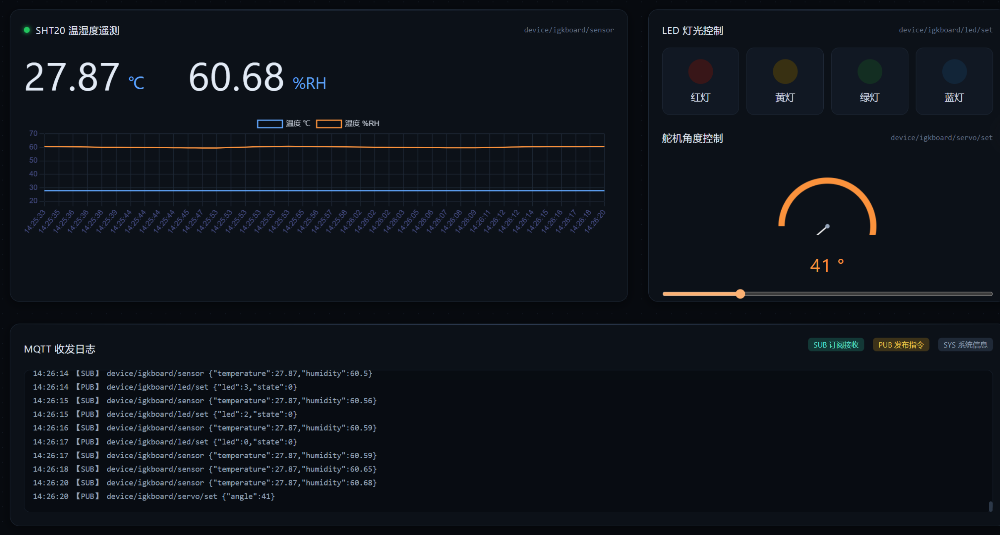
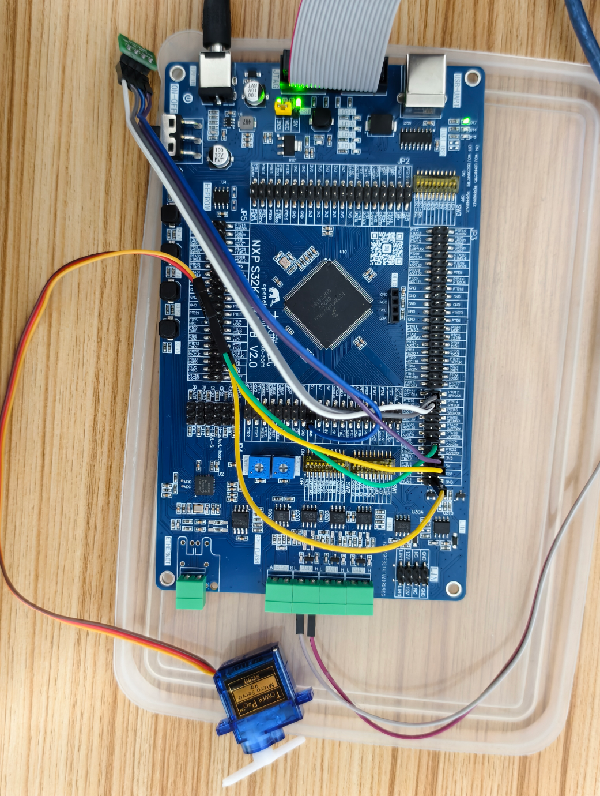
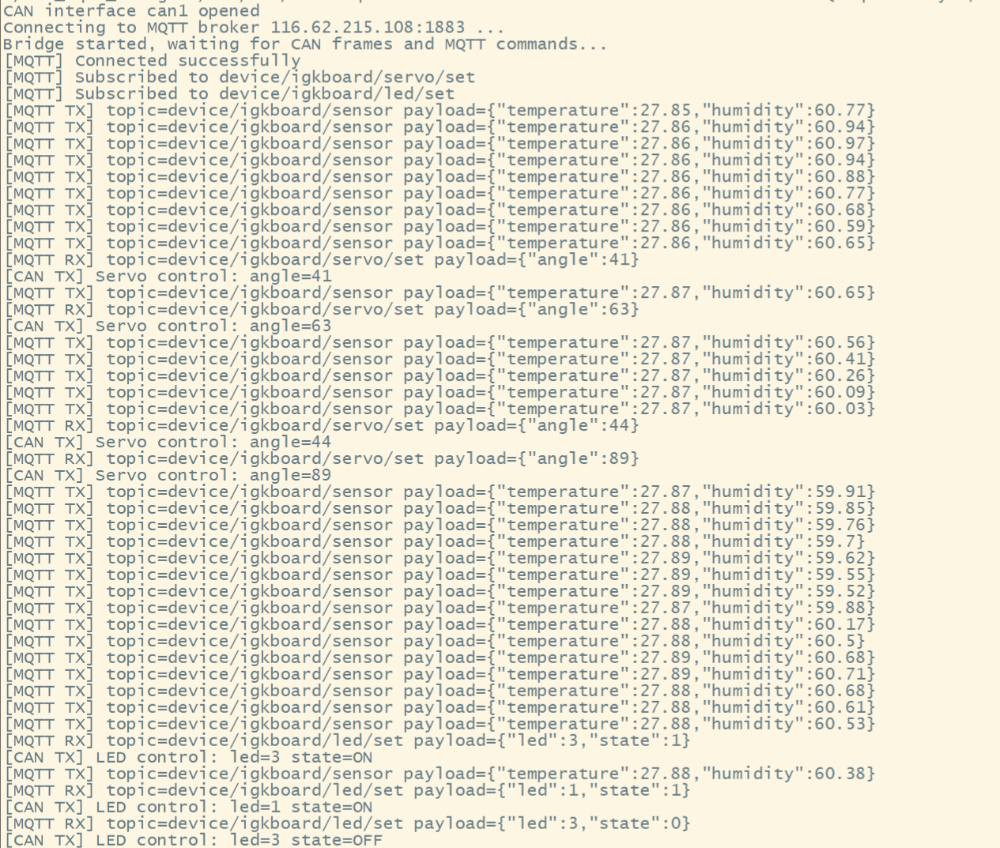
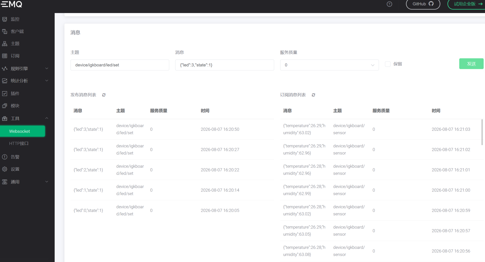

# 基于S32K148的车载CAN总线智能感知与控制系统

一个覆盖 **MCU固件 → CAN总线通信 → 嵌入式网关 → 云端存储 → Web可视化** 完整链路的嵌入式物联网项目，基于NXP S32K148(Arm Cortex-M4)搭建AUTOSAR MCAL层驱动架构，实现传感器数据采集、执行机构控制与远程监控。

---

## 目录

- [系统架构](#系统架构)
- [效果演示](#效果演示)
- [功能特性](#功能特性)
- [硬件连接](#硬件连接)
- [CAN报文设计](#can报文设计)
- [各模块说明](#各模块说明)
- [遇到的问题与解决方案](#遇到的问题与解决方案)

---

## 系统架构

```
┌─────────────┐   I2C   ┌──────────────────────┐
│ SHT20温湿度  │ ───────>│                      │
│   传感器     │         │   S32K148            │
└─────────────┘         │ (AUTOSAR MCAL架构)    │
                        │                     │
┌─────────────┐   PWM   │  Port / Mcu / I2c    │
│   SG90舵机   │ <───────│  Pwm / Can_43_FLEXCAN │
└─────────────┘         │  CanIf / Uart / Dio   │
                         └──────────┬───────────┘
                                    │ CAN总线
                                    │ (0x100 / 0x101 / 0x122)
                                    ▼
                         ┌──────────────────────┐
                         │   嵌入式Linux网关      │
                         │  CAN <-> MQTT 协议转换 │
                         └──────────┬───────────┘
                                    │ MQTT
                                    ▼
                         ┌──────────────────────┐
                         │     EMQX Broker       │
                         └──────────┬───────────┘
                                    │
                     ┌──────────────┴──────────────┐
                     ▼                              ▼
            ┌─────────────────┐           ┌─────────────────┐
            │    InfluxDB      │           │    Web前端       │
            │   时序数据存储    │           │   实时可视化展示  │
            └─────────────────┘           └─────────────────┘
```

---

## 效果演示

> 拖动Web端角度滑块，实时控制舵机转动；点击LED按钮，实时控制板载指示灯；SHT20温湿度数据每秒上报，Web端曲线图实时刷新。
>
> 

完整演示视频：[点击观看演示视频](Videos/Can_Web_S32K148.mp4)

**Web端监控面板：**



**硬件实物连接：**



**网关CAN-MQTT桥接运行日志：**



**EMQX Broker消息监控：**



---

## 功能特性

- **SHT20温湿度采集**：通过I2C(LPI2C1)驱动实现SHT20传感器数据读取，每秒通过CAN上报
- **舵机角度控制**：通过PWM(FTM3)输出标准舵机控制信号，支持0°~180°角度远程控制
- **多路LED控制**：通过CAN报文远程控制板载4路LED开关状态
- **CAN多节点通信**：基于AUTOSAR Can_43_FLEXCAN/CanIf驱动，实现多路CAN报文独立收发
- **CAN-MQTT协议转换**：嵌入式Linux网关实现CAN帧与MQTT消息的双向桥接
- **云端数据存储**：接入InfluxDB时序数据库，实现历史数据存储
- **Web实时可视化**：温湿度曲线图、舵机角度仪表盘、LED状态卡片、MQTT收发日志实时展示

---

## 硬件连接

| 功能 | 外设/信号 | S32K148引脚 | 说明 |
|---|---|---|---|
| I2C通信 | SDA | PTC31 (LPI2C1_SDA) | 连接SHT20传感器 |
| I2C通信 | SCL | PTD19 (LPI2C1_SCL) | 连接SHT20传感器 |
| PWM输出 | 舵机信号线 | PTB8 (FTM3_CH0) | 50Hz，0.5~2.5ms脉宽 |
| CAN通信 | CAN0_TX/RX | PTE4/PTE5 | 连接CAN收发器/TSMaster |
| UART调试 | TX/RX | PTA2/PTA3 (LPUART0) | 串口调试输出 |

**主要硬件清单：**
- NXP S32K148Q-EVB 开发板
- SHT20 温湿度传感器模块
- SG90 舵机
- CAN分析仪 / TSMaster（上位机调试）
- 嵌入式Linux网关板（CAN转MQTT）

---

## CAN报文设计

为避免多设备共用接收邮箱导致的报文冲突，各功能采用独立CAN ID：

| CAN ID | 方向 | 功能 | 数据格式 |
|---|---|---|---|
| `0x100` | 接收 | LED开关控制 | `Byte0`=LED编号，`Byte1`=开关状态 |
| `0x101` | 接收 | 舵机角度控制 | `Byte0`=角度值(0~180) |
| `0x122` | 发送 | SHT20温湿度上报 | 温度+湿度数据(定时1s上报) |

---

## 各模块说明

### S32K148_Can —— MCU固件

基于S32 Configuration Tool生成AUTOSAR MCAL层驱动配置，主要模块：

- `Port` / `Mcu` / `Platform`：时钟、引脚复用初始化
- `Can_43_FLEXCAN` / `CanIf`：CAN总线收发与报文路由
- `CDD_I2c`：I2C同步通信驱动，用于SHT20读取
- `Pwm`：基于FTM定时器的PWM信号生成，用于舵机控制
- `Uart`：调试信息输出
- 应用层：`sht20.c`（传感器读取）、`servo.c`（舵机角度控制）、`CDD.c`（CAN接收回调分发）

### Gateway_Can —— 嵌入式网关

运行于Linux嵌入式板卡，核心程序 `can_mqtt_bridge`：

- 通过SocketCAN接口(`can1`)监听CAN总线报文
- 将CAN帧解析后，以JSON格式发布至MQTT对应主题(`device/igkboard/sensor`等)
- 订阅控制类主题(`device/igkboard/led/set`、`device/igkboard/servo/set`)，将MQTT下发指令转换为CAN帧发送

### STM32_Can —— 历史版本

项目早期基于STM32平台的实现版本，作为技术演进过程保留。

### Web —— 前端展示

基于MQTT WebSocket连接EMQX Broker，实现：

- 温湿度实时曲线图
- 舵机角度仪表盘（滑块控制+实时角度显示）
- LED灯光控制面板
- MQTT收发日志实时滚动展示

